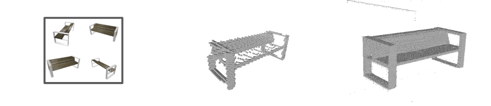

## 3D_insight
This git repository is an exploration on the ability of neural networks to construct 3D models from 2D images. In this pursuit, the repository uses networks from Chris Choy (3D-R2N2) and Bo Yang (3D-RecGAN).

## Main Idea

Recent work improving 3D models using GANs in combination with previous work generating rough 3D models may enable the creation of useable 3D models from a group of 2D images.

## Proof of Concept

Below in an image of the input 2D images, initial rough reconstruction from the pretrained R2N2 network, and the overtrained RecGAN on the example bench.

## Package Requirements

The networks each have their own requirment files in their respective folders. It is recommended that a seperate virtual enviornment be set up for each one since R2N2 is written in theano and RecGAN is in Tensorflow.

## Runing a test

Currently this repo does not have a single command line executable. This will be coming soon after creation of training data is complete. For now use notebooks to modify the input images, file outputs from one network to another, and saving the final output as a .obj file, with modified scripts to run inference on the networks.

@inproceedings{choy20163d,
title={3D-R2N2: A Unified Approach for Single and Multi-view 3D Object Reconstruction},
author={Choy, Christopher B and Xu, Danfei and Gwak, JunYoung and Chen, Kevin and Savarese, Silvio},
booktitle = {Proceedings of the European Conference on Computer Vision ({ECCV})},
year={2016}
}

##@inProceedings{Yang18,
title={3D Object Dense Reconstruction from a Single Depth View},
author = {Bo Yang and Stefano Rosa and Andrew Markham and Niki Trigoni and Hongkai Wen},
booktitle={arXiv preprint arXiv:1802.00411},
year={2018}
}
